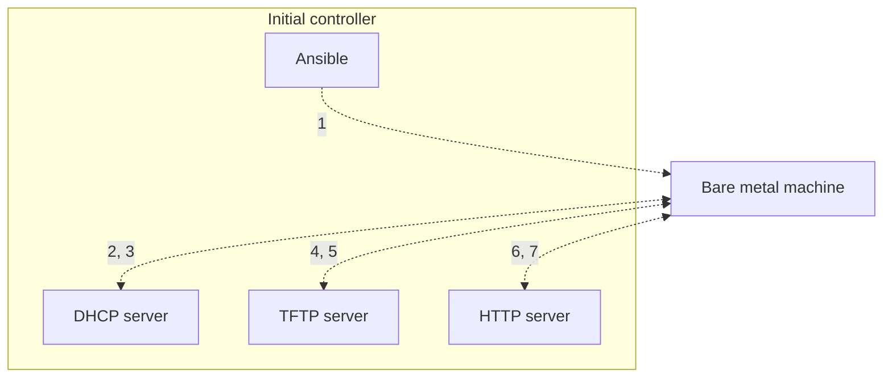

# PXE boot

1. Ansible: Hey MAC address `xx:xx:xx:xx:xx:xx`, wake up!
2. Machine: Hello everyone, I just woke up in network mode, could someone please show me how to boot?
3. DHCP server: I hear you, here's your IP address, proceed to the next server to obtain your bootloader.
4. Machine: Hello, could you please send me my bootloader?
5. TFTP server: Here you go. Grab your boot configuration, kernel, and initial ramdisk as well.
6. Machine: Hi, I just booted into my bootloader, and my boot parameters instructed me to get the installation instructions, packages, etc. from this site.
7. HTTP server: It's all yours.
8. Machine: Great, now I can install the OS and reboot!

Here's how it looks like in action:

<iframe width="560" height="315" src="https://www.youtube-nocookie.com/embed/y-d7btNNAT8" title="YouTube video player" frameborder="0" allow="accelerometer; autoplay; clipboard-write; encrypted-media; gyroscope; picture-in-picture" allowfullscreen></iframe>

## Netboot.xyz

[Netboot.xyz](https://netboot.xyz/) is a great resource for PXE booting. It provides a list of bootable images for various operating systems, including Linux, Windows, macOS, and more.

> ✍**Notes**:
>
> The Netboot.xyz process is not yet fully automated, you need to manually select the image to install. But the steps are very simple.
> TODO: Automate the process of selecting the image to boot the device.

Currently, we use Netboot.xyz as the PXE boot source by default. After the device enters PXE boot mode, it will enter the netboot.xyz boot interface, and then we need to **manually** select the image to boot the device.The details are as follows.

1. Choose **Installers -> Linux Installers**
2. Choose **Operating Systems -> Ubuntu**
3. Choose **UUbuntu 24.04 LTS**

Sample steps are as follows:

### Why Netboot.xyz?

This opens up endless possibilities for changing operating systems in the future.

### Booting from TFTP

If you want to utilize netboot.xyz from your home or office network, it's relatively easy to set up. It will allow all of your devices on your network to have netboot.xyz available whenever you need it by just changing the boot order on your device, selecting network boot, or manually selecting the device to boot.

You will have to tell your DHCP server to provide a "next-server"(or `boot` `serveraddress`), the address of a TFTP server on your network, and a "filename", the netboot.xyz boot file (you can choose among different architecture systems here). When your clients boot up, if they are set to network boot, they'll automatically get a valid DHCP address, pull down the netboot.xyz iPXE bootloader and load up the Operating System menu.

### Netboot.xyz Docker

We are actually using the Netboot.xyz Docker to start the Netboot.xyz server.

The [netboot.xyz docker image](https://github.com/netbootxyz/docker-netbootxyz) allows you to easily set up a local instance of netboot.xyz. The container is a small helper application written in node.js. It provides a simple web interface for editing menus on the fly, retrieving the latest menu release of netboot.xyz, and enables mirroring the downloadable assets from Github to your location machine for faster booting of assets.

The container is built upon Alpine Linux and contains several components:

- netboot.xyz [webapp](https://github.com/netbootxyz/webapp)
- Nginx for hosting local assets from the container
- tftp-hpa
- syslog for providing tftp activity logs

Services are managed in the container by [supervisord](http://supervisord.org/).

The container runs fine under ARM-based hosts as well as x86-64.

> 📚️**References**:
>
> [netboot.xyz docs](https://netboot.xyz/docs/)
